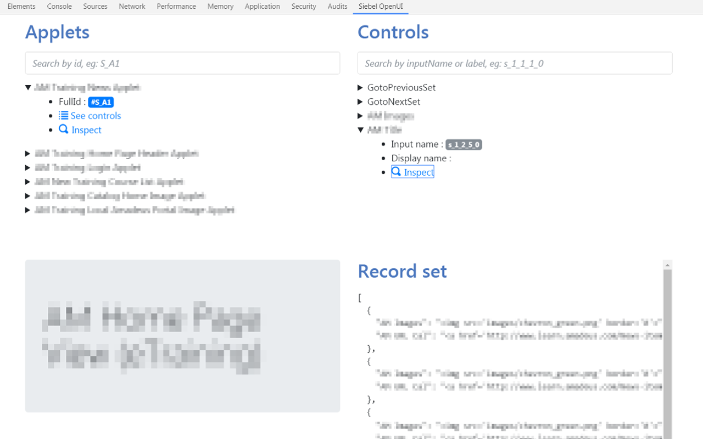

Siebel OpenUI (non-official) DevTools
=====================================

Non-Oracle affiliated Chrome DevTools extension for inspecting Siebel OpenUI layer.

Features
--------
* Get views details :
    * Applets
    * Controls
* Inspect Applet or a Control HTML element

Installing from the Web Store
-----------------------------
https://chrome.google.com/webstore/detail/siebel-openui-devtools/olcgheplggcilliajjdpnfiggndhlphj

This is the recommended method as you will have the latest stable release.

Install from source
-------------------
Using Google Chrome:

* Click on Tools -> Settings -> Extensions.
* Select "Enable developer mode" in the upper right of the window.
* Click on "Load unpacked extension".
* Select the extracted folder.
* Restart the browser.

License
-------
MIT
